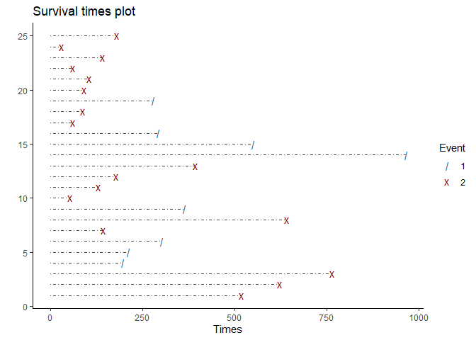
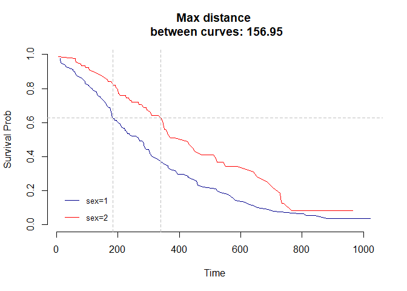
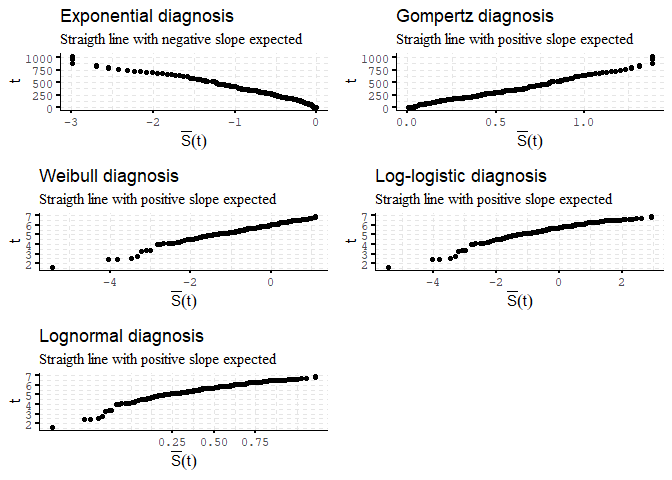

<!-- README.md is generated from README.Rmd. Please edit that file -->

# survextras

<!-- badges: start -->

[](https://www.tidyverse.org/lifecycle/#experimental)
<!-- badges: end -->

The goal of survextras is to provide helper functions for survival
analysis.

## Installation

You can install the development version from
[GitHub](https://github.com/) with:

``` r
# install.packages("devtools")
devtools::install_github("alberto-mateos-mo/survextras")
```

The package contains 3 main functions:

  - `intro_surv()`
  - `max_diff_time()`
  - `parametric_diagnose()`

## Example

`intro_surv()` function will give you an introductory plot of your
survival data:

``` r
library(survextras)
library(survival)

intro_surv(df = cancer, times = "time", event = "status", interactive = FALSE)
#> Loading required package: manipulate
#> Loading required package: dplyr
#> 
#> Attaching package: 'dplyr'
#> The following objects are masked from 'package:stats':
#> 
#>     filter, lag
#> The following objects are masked from 'package:base':
#> 
#>     intersect, setdiff, setequal, union
#> Loading required package: ggplot2
```



`max_diff_time()` function finds and plots maximun difference time
fitted survival curves.

``` r
library(survextras)
library(survival)
library(survminer)
#> Loading required package: ggpubr
#> Loading required package: magrittr

fit <- surv_fit(Surv(time, status)~sex, data = cancer)
max_diff_time(fit)
#> Loading required package: grid
```



`parametric_diagnose()` function creates assesment plot to diagnose if
KM estimator could potentially follow a known distribution.

``` r
library(survextras)
library(survival)
library(survminer)

kmfit <- surv_fit(Surv(time, status)~1, data = cancer)
parametric_diagnose(kmfit)
#> Loading required package: scales
```


